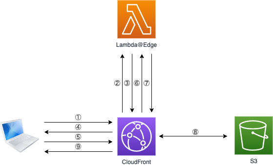

Example Lambda@Edge
===================

* [pack-zip](https://www.npmjs.com/package/pack-zip)


Source: https://docs.aws.amazon.com/ja_jp/lambda/latest/dg/images/cloudfront-events-that-trigger-lambda-functions.png

# Setup

```
$ (cd deploy/s3; sls deploy -s <STAGE> -v)
```

```
$ (cd modules/genkeypair; npm i; tsc; BUCKET_NAME=<YOUR KEY BUCKET NAME> node src/genkeypair.js)
```

# Build

```
$ (cd modules/edge; npm i; tsc; npm run build-aws-resource)
```

# Deploy

```
$ (cd deploy/edge; sls deploy -s <STAGE> -v)
```

# Design



1. web site にアクセス
2. Lambda@Edge の呼び出し
3. 秘密鍵 (private key) で署名した JWT を Cookie に設定するリダイレクト応答
4. JWT を Cookie として保存
5. 再度、web site にアクセス
6. Lambda@Edge の呼び出し
7. Cookie の JWT を公開鍵 (public key) で検証
8. S3 のコンテンツの取得
9. S3 のコンテンツがブラウザに返される
